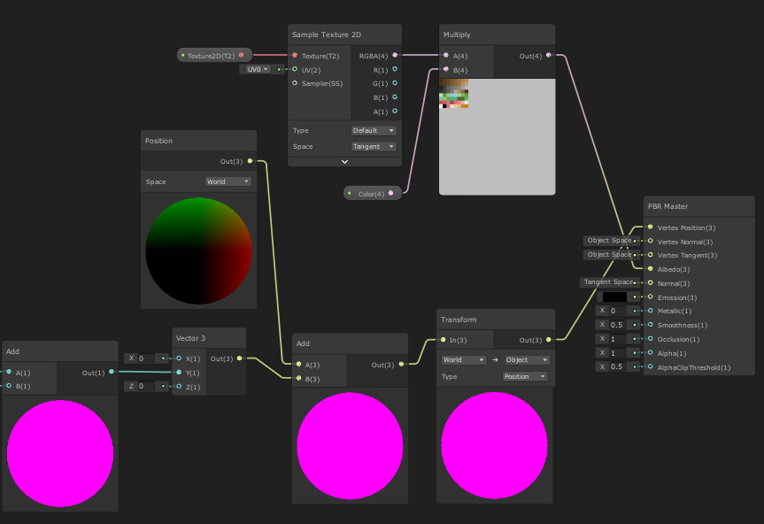

# Curved World
This is a recreation of the *curved world* effect seen in many games. This is where the curviture of the world is stylistically exaggerated, so that it is easily seen. This makes it so that objects will disappear over the horizon more quickly than you would normally expect (or at all, as there is no finite horizon in Unity). Using a shader for this means no curved geometry needs to be made, when the game renders the flat ground will look like it is curved. Many games use this to spawn in things ahead of you without dealing with pop-in, a tactic common in endless runners. 

I specifically designed this shader after the curved world effect in Animal Crossing: New Horizons. This game appears to be using this effect to lessen the difference between camera angles: it cranks up the curvature of the world at lower angles, hiding behind the horizon some of the extra terrain you would be able to see. Mechanically the game is showing you around the same amount of information at any of the three camera angles, which can be seen as encouraging you to focus on near-by objects. Objects over the horizon that are tall enough can be seen over the horizon, which can even aid in navigation.

  
*The three camera angles in Animal Crossing: New Horizons. The middle angle actually shows more terrain than the lowest.*

## Implementation

I implemented something similar to the camera from Animal Crossing in Unity. I used the Shader Graph tool to make the [curved world shader](CurevedWorld/Assets/CurveWorld.shadergraph), a shader that uses vertex displacement. That shader has exposed parameters, one of which controls the steepness of the curve. In the CameraController, that value is interpolated along with camera movements.

  
*An image of the scene view in Unity showing the normally flat ground plane deformed into a parabola (traced in red here) by the shader.*

***y = a(x-h)<sup>2</sup> + k***  
*Parabola equation*

The shader works by changing the y value of vertices based on their z delta from the camera, over a parabola. It finds the z delta by subtracting the camera's position from the position of the vertex, and isolating the z value (*x*). Another subtract node provides a horizontal pahse shift (*h*). Bringing that to a power of two creates the ark of the parabola. The CurveAmount is multiplied by a small negative number to flip the parabola and give it a decent amplitude (*a*). An add node gives a vertical phase shift (*k*). That gets added to the y position of the vertex and that's applied to the master node.  


*The curved world shader in Unity Shader Graph*

  
*y = a( __x-h__ )<sup>2</sup> + k*

  
*y = __a(__ x-h __)<sup>2</sup> + k__*

  
*__y =__ a( x-h )<sup>2</sup> + k*

Once this shader is applied to everything that needs to respond to it, the world is curved! In [CameraController.cs](CurevedWorld/Assets/CameraController.cs) the shader's curve is adjusted over time whenever the camera angle is changing. This mimics the angle curve changing effect in New Horizons.

```C#
IEnumerator CameraShift(Vector3 offset, Quaternion rot, float amount, float moveTime){
    moving = true;
    float startTime = Time.time;
    float perc = 0;
    Vector3 startOffset = curOffset;
    Quaternion startRot = transform.rotation;
    float startAmount = curveMats[0].GetFloat("CurveAmount");
    while(perc < 1){//lerp between positions, rotations, and shader values
        perc = (Time.time - startTime) / moveTime;
        curOffset = Vector3.Lerp(startOffset, offset, perc);
        transform.rotation = Quaternion.Lerp(startRot, rot, perc);
        foreach(Material mat in curveMats)
            mat.SetFloat("CurveAmount", Mathf.Lerp(startAmount, amount, perc));
        yield return null;
    }
    //make sure it got to the destination
    curOffset = offset;
    transform.rotation = rot;
    foreach(Material mat in curveMats)
        mat.SetFloat("CurveAmount", amount);
    moving = false;
}
```
*Snippet from [CameraController.cs](CurevedWorld/Assets/CameraController.cs)*

## Results


The final product is a camera that has a very similar feel to the one in Animal Crossing. It smoothly transitions between the camera angles with matching changes to the curvature of the shader. 

### Details
#### How to Run
Download this repo  
Open the folder [Curved World](CurevedWorld) in Unity 2019.3.7f1 (this uses an early version of Shader Graph, using a newer version may have strange results)
Press play button  
You can view the shader by clicking on CurveWorld.shadergraph in the asset window

#### Assets Used
Nature Pack Lite - Unity Asset Store  
Super Cyan Character Pack Free - Unity Asset Store
